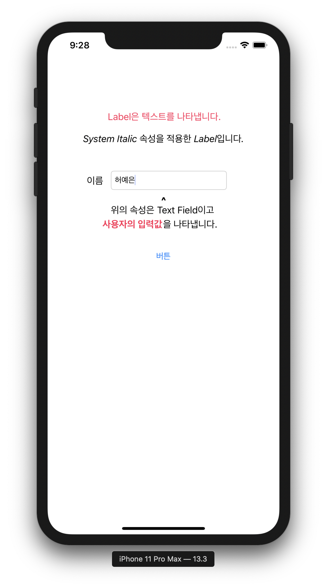
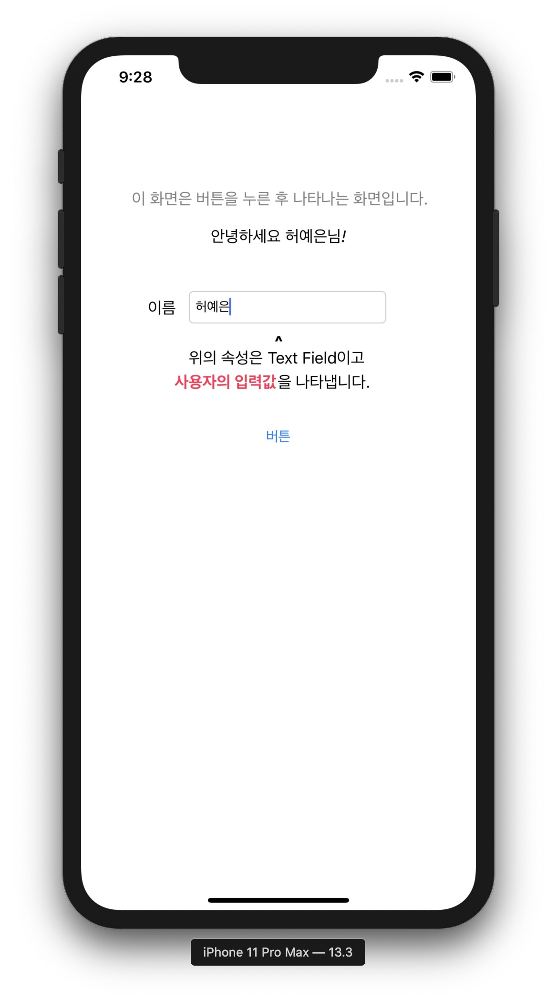
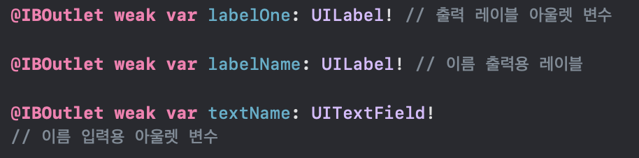
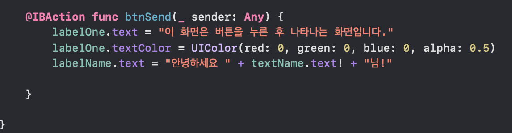

## FIRST LESSON
> 앱개발 준비
* 초기화면

</img>

* 버튼 클릭 후 화면

</img>

***

* 함수 상세설명

</img>
  
    * @IBOutlet: 아울렛 변수를 정의
      * 참고: @IB로 시작되는 변수 => 인터페이스 빌더와 관련
    
    * var labelOne: labelOne 변수를 선언
    
    * UILable!: 레이블 객체의 변수를 선언 
    
    * UITextField!: 텍스트 필드 객체의 변수를 선언
  
  </img>
  
    * @IBAction: 액션함수를 정의 
    
    * func btnSend: 액션함수에서 어떤 기능을 수행할지를 정의해주는 함수 정의
    
    * (_ sender: Any): 버튼이 클릭되면, 함수를 실행 이때 하나의 액션만 이루어지므로 Any를 사용하여 액션을 정의할 수 있음.
    
    * labelOne.text! = " 입력하고 싶은 문장을 삽입 ": 해당 레이블(labelOne)의 텍스트를 강제로 변환 (!가 강제 언래핑 기능을 수행)
    
    * labelOne.textColor!: 해당 레이블(labelOne)의 텍스트 색상을 강제로 변환
  
