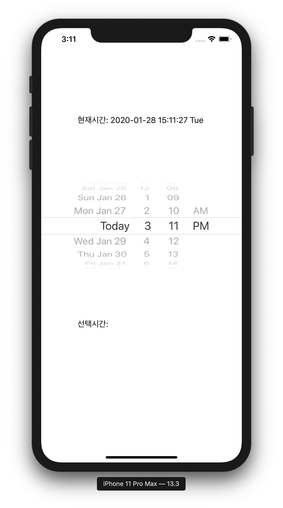
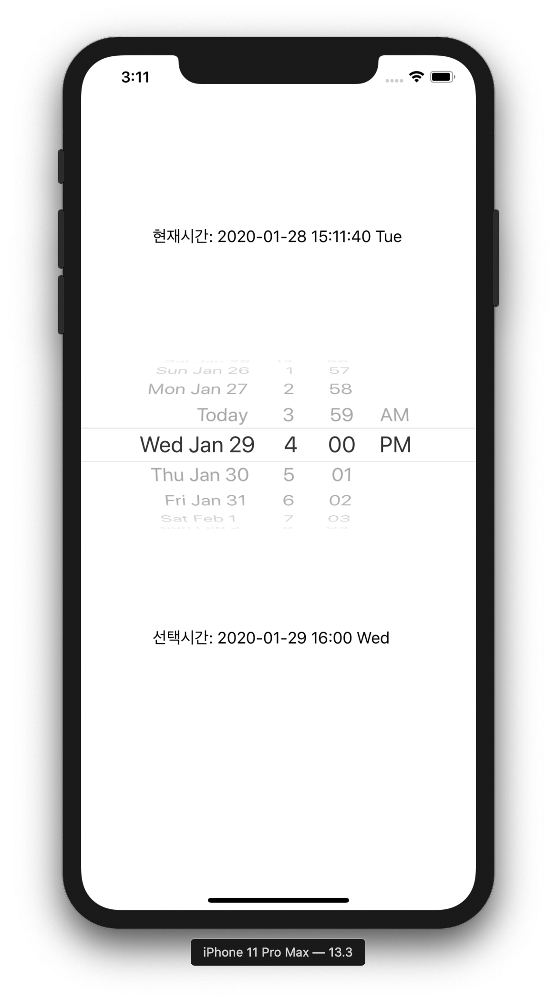
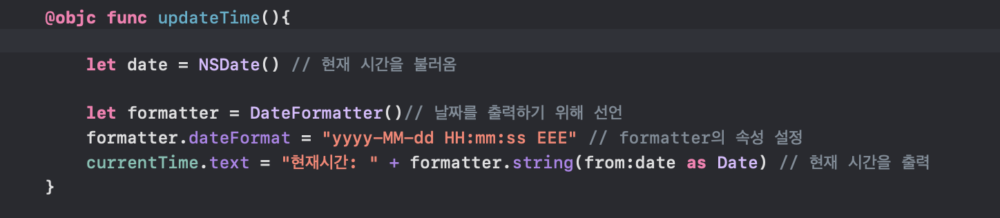
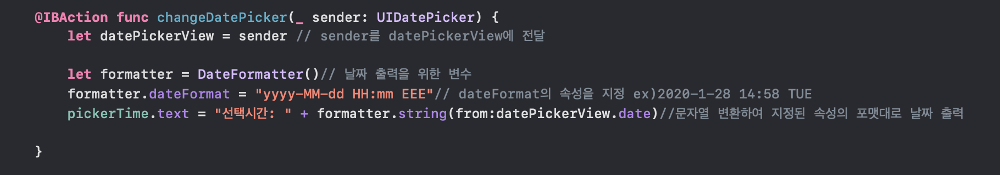
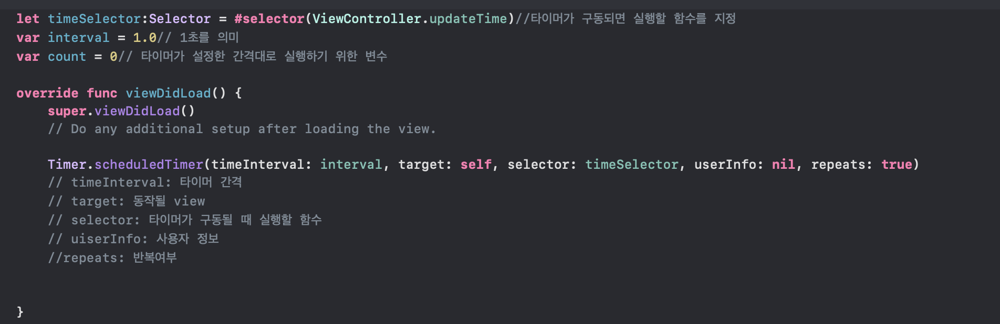

## Second Lesson
> DatePicker

* 초기화면

</img>

* Date Picker로 시간을 설정한 경우

</img>

***

* 함수 설명
  * 현재시간 불러오기

</img>

      * NSDate() : 현재시간을 불러오는 함수
      
      * formatter = DateFormatter(): 날짜를 출력하기 위한 포맷 불러오기
      
      * formatter.dateFormat = "yyyy-MM-dd HH:mm:ss EEE" : 포맷 속성 설정 
      // yyyy: 연도 4자리
      
      // MM: 월 2자리
      
      // dd: 일 2자리
      
      // HH: 시 2자리 (01~24까지)
      
      // mm: 분 2자리
      
      // ss: 초 2자리
      
      // EEE: 요일 3자리
      
 
      
  * 선택시간 불러오기 
  
</img>

    * datePickerView = sender: sender을 datePickerView에 전달
    
    * pickerTime.text = "선택시간: "+ formatter.string(from:datePickerView.date): 시간을 문자열로 변환하여 지정된 속성의 포맷대로 날짜를 출력

    
  * timer 설정
  
  </img>
  
    * let timerSelector:Selector = #selector(ViewController.updateTime): 타이머가 구동되면 실행할 함수 지정
    
    * var interval = 1.0 : interval을 1초로 지정
    
    * var count = 0 : 타이머가 설정한 간격대로 실행하기 위한 변수
    
    * Timer.scheduledTimer(timeInterval: interval, target:self, selector: timeSelector, userInfo: nil, repeats:true)
    
    // timeInterval: 타이머 간격을 설정
    
    // target: 동작될 view를 설정
    
    // selector: 타이머가 구동될 때 실행할 함수를 설정
    
    // userInfo: 사용자 정보
    
    // repeats: 반복 여부 (true면 반복 o, false면 반복 x)
    
  
