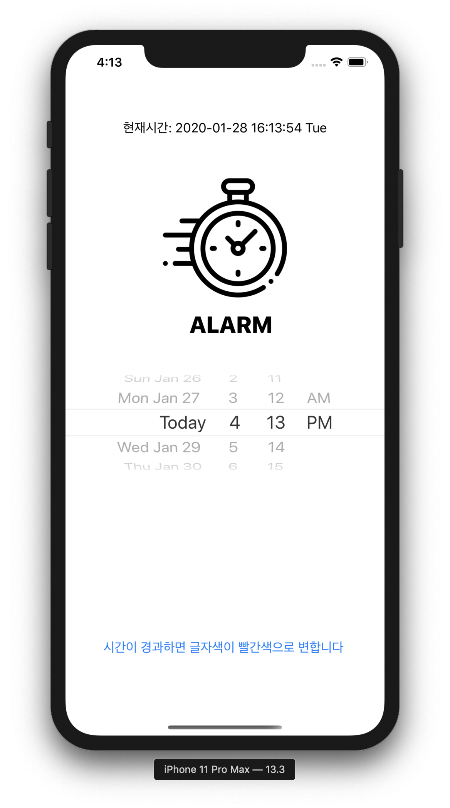
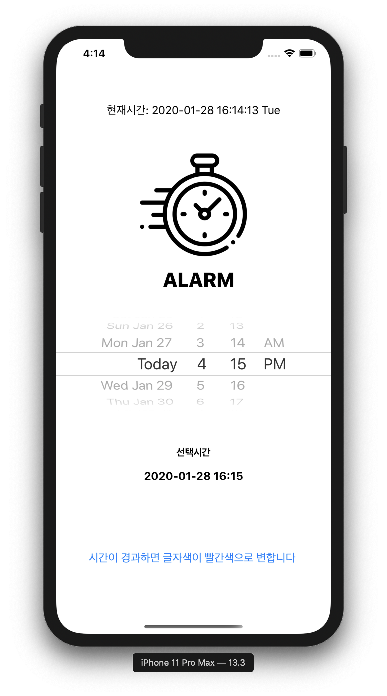
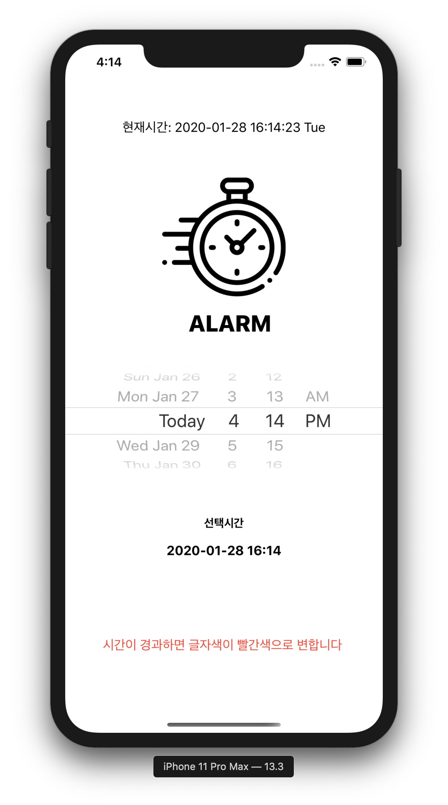

## Second Lesson
> alarmClock

* 초기화면

</img>

* 시간을 설정한 경우

</img>

* 설정한 시간이 현재시간과 같을 경우

</img>

***

* 함수 설명
  * 선택시간 불러오기

</img>

      * let datePickerView = sender: sender로 받은 UIDatePicker을 datePickerView 변수에 대입
      
      * let formatter = DateFormatter(): 시간 속성을 formatter 변수에 대입하여 시간에 대한 변수를 가지게 함
      
      * formatter.dateFormat = "yyyy-MM-dd HH:mm": 시간을 어떻게 나타낼 것인지에 대한 속성값을 대입
      
      * pickerTime.text = formatter.string(from:datePickerView.date): 위에 나타내었던 datePickerView를 문자열형으로 변환한 후 pickerTime의 텍스트에 대입
  
      * formatter.dateFormat = "hh:mm": 시간 속성을 바꿈
      
      * alarmTime = formatter.string(from:datePickerView.date): 속성을 바꾼 시간을 alarmTime 변수에 대입
 
      
   * 현재시간 불러오기
  
</img>

    * let date  = NSDate(): 함수를 통해 현재의 시간을 date에 대입
    
    * let formatter = DateFormater(): 시간 속성을 formatter변수에 대입하여 시간에 대한 변수를 가지게함
    
    * currentTime.text = "현재시간: "+ formatter.string(from:date as Date): 현재시간을 나타내주는 date변수를 불러옴
    
    * if(current == alarmTime) : 설정한 시간과 현재시간과 같으면
    
    * labelChange.textColor = UIColor.systemRed: labelChange라는 label 변수의 색상을 systemRed로 변환
    
    * else{ labelChange.textColor = UIColor.systemBlue}: 아니라면 labelChanage라는 label 변수의 색상을 systemBlue로 변환
    
    
    
 
