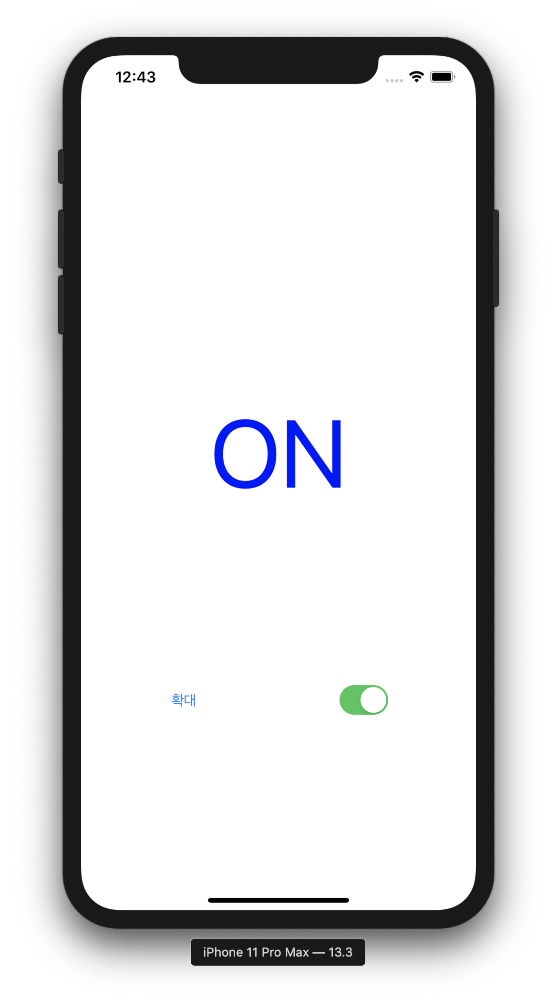
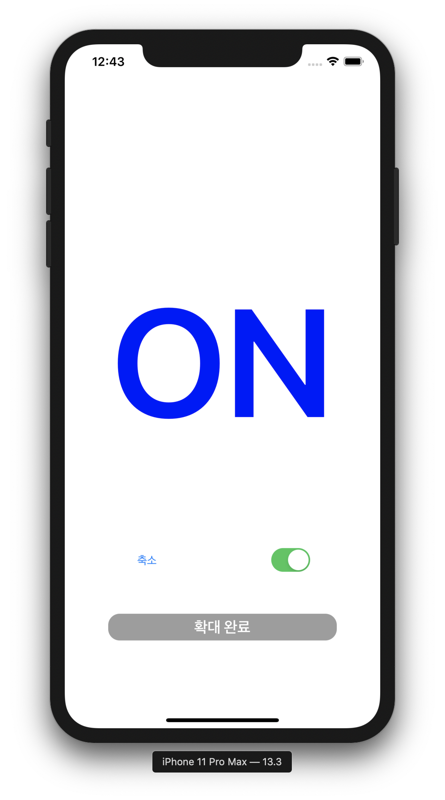
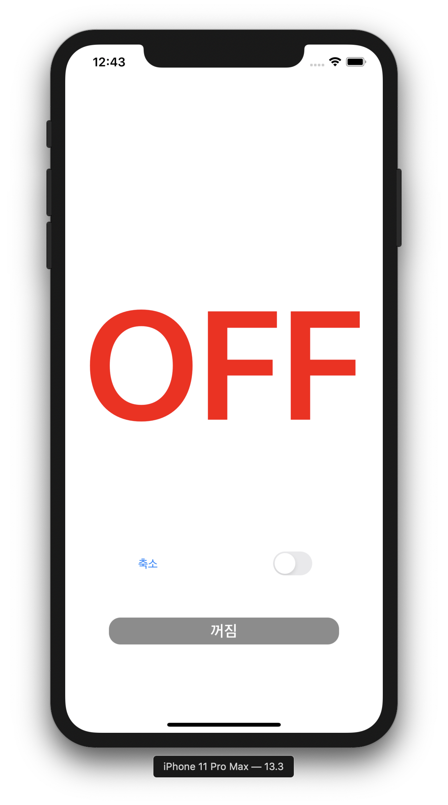
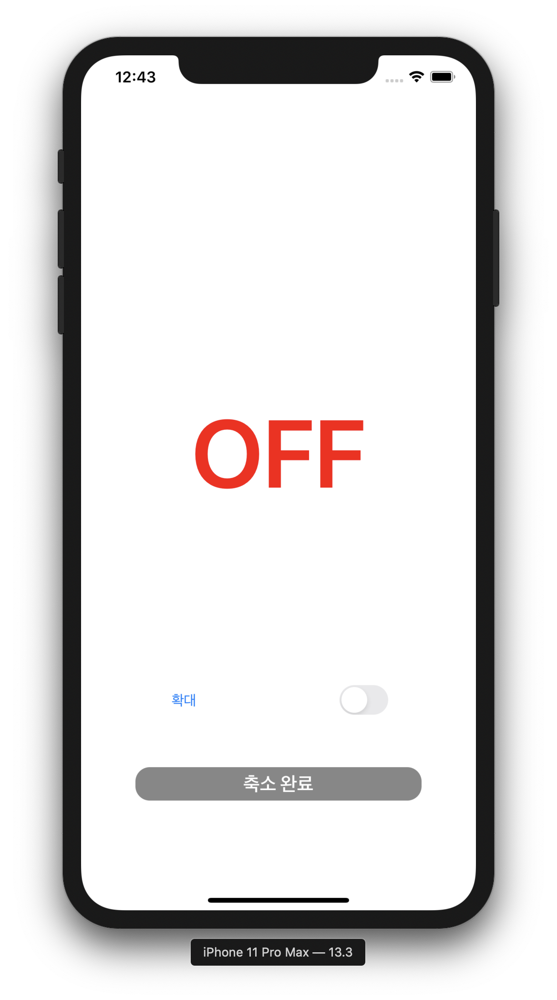
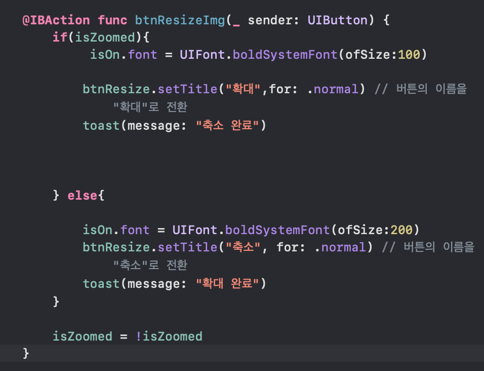
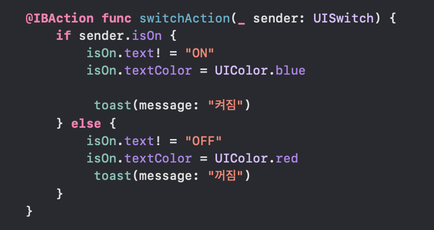
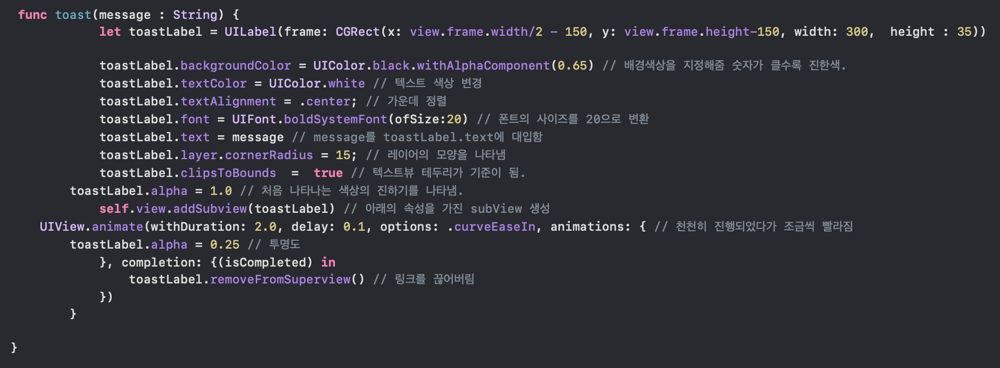

## Second Lesson
> imageView 응용

* 초기화면

</img>

* 스위치가 켜진 상태에서 확대 버튼을 눌렀을 경우

</img>

* 스위치 버튼을 껐을 경우 

</img>

* 스위치가 꺼진 상태에서 축소 버튼을 눌렀을 경우

</img>

***

* 함수 설명
  * 텍스트 Zoom in, Zoom out

</img>

      * UIFont.boldSystemFont(ofsize:지정하고 싶은 사이즈의 숫자): 폰트의 크기를 지정
      
      * btnResize.setTitle("확대",for: .normal): 버튼의 이름을 "확대"로 변경
      
      * toast(message: "축소 완료"): toast함수를 띄워 작업이 완료됨을 알려줌 (toast 함수 설명에서 자세히 다룰 예정)
      
  * 스위치 on off
  
</img>

    * if sender.isOn: 받은것이 isOn이면 아래의 액션이 일어남
    
    * isOn.text! = "ON": label isOn의 텍스트를 "ON"으로 강제 래핑
    
    * isOn.textColor = UIColor.blue: label isOn의 텍스트의 색상을 파란색으로 변경
    
    * toast(message: "켜짐"): toast 함수를 띄워 작업이 완료됨을 알려줌 (toast 함수 설명에서자세히 다룰 예정)
    
  * toast 띄우기
  
  </img>
  
    * let toastLabel = UILabel(frame: CGRect(x: view.frame.width/2 - 150, y: view.frame.height-150, width: 300,  height : 35)): 라벨의 모양을 정의
    
    * toastLabel.backgroundColor = UIColor.black.withAlphaComponent(0.65): 배경색지정. withAlphaCompnoent의 값이 크면클 수록 진하기가 높음
    
    * toastLabel.textAlignment = .center;: 텍스트 가운데정렬
    
    * toastLabel.text = message: 앞에서 나왔던 toast(message: "메시지")를 받아서 toastLabel.text에 대입
    
    * toastLabel.font = UIFont.boldSystemFont(ofSize:20): 앞에서 나왔던 toast(message: "메시지")의 크기를 조절
    
    * toastLabel.clipsToBounds = true: 텍스트뷰 테두리가 기준이 되어서 작업을 수행
    
    * toastLabel.alpha: 처음 효과가 일어날 때 배경화면의 진하기를 지정
    
    * self.view.addSubview(toastLabel): 위의 속성을 가진 subView 생성 (이미지에는 "아래의" 라고 오타가 나있음!)
    
    * UIView.animate(withDuration: 2.0, delay: 0.1, options: .curveEaseIn, animations: { 
        toastLabel.alpha = 0.25 : view의 애니메이션 지정 (지속시간 2초, 딜레이 0.1초, 애니메이션 효과 옵션: 천천히 진행되었다가 빠르게 사라지는 옵션, toastLabel.alpha: 애니메이션의 투명도 조절
        
    * completion: {(isCompleted) in
                toastLabel.removeFromSuperview() 
            })
        }: 위의 액션이 끝나면 액션의 링크를 끊어버림.
  
  
