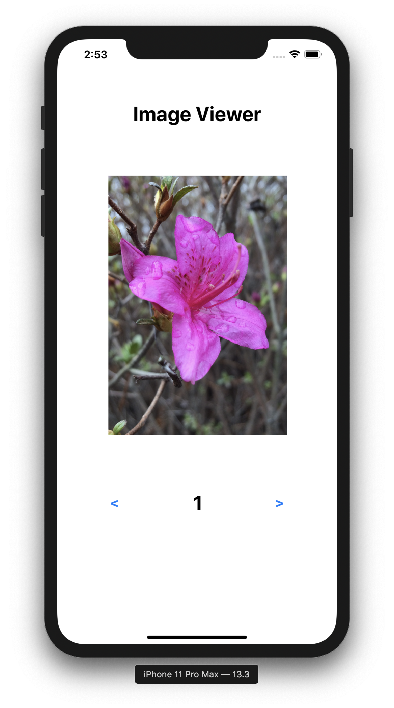
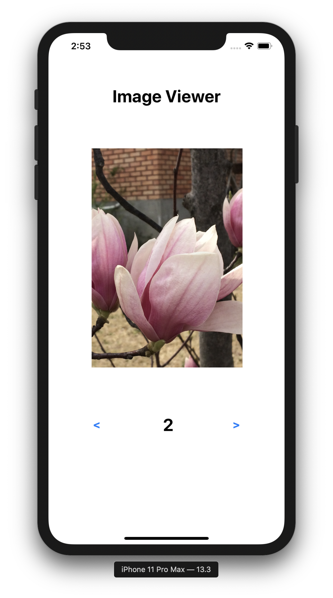
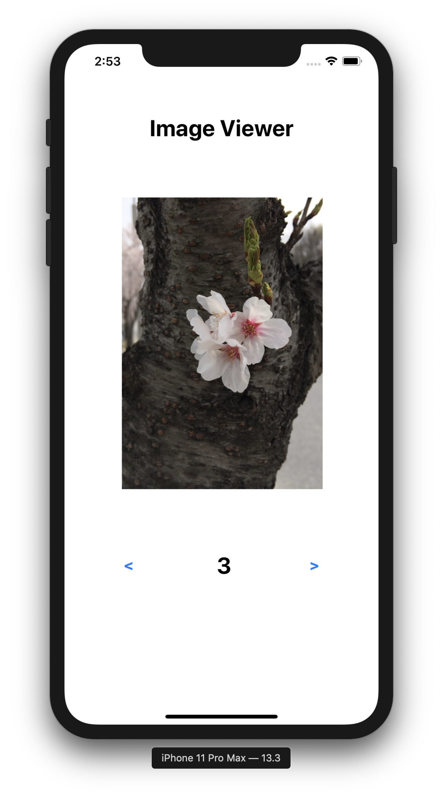
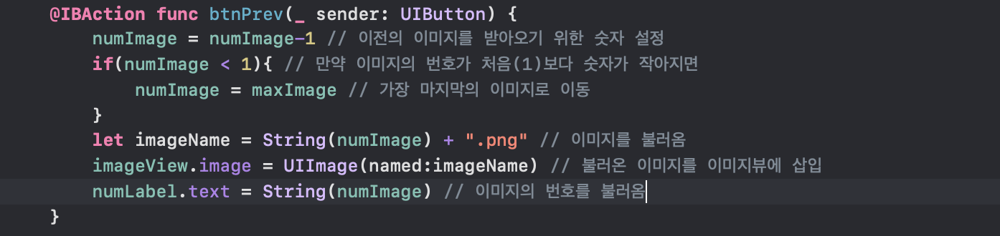

## Second Lesson
> imageViewer

* 초기화면

</img>

* 다음이미지로 넘긴 경우

</img>

* 그 다음 이미지로 넘긴 경우
</img>

* 이전 이미지로 넘긴 경우
</img>

***

* 함수 설명
  * 이전 이미지로 이동하는 버튼 구현

</img>

      * numImage = numImage-1: 이미지의 번호가 들어가있는 numImage의 번호를 1씩 감소
      
      * numImage = maxImage: 만약 이미지가 첫번째 번호를 가진 이미지라면 이전 버튼을 누르면 마지막 이미지로 갈 수 있게 numImage를 마지막 번호로 지정
      
      * let imageName = String(numImage) + ".png": 해당 번호에 들어가는 이미지를 imageName 변수에 대입
      
      * imageView.image = UIImage(named:imageName): 위에서 받아온 imageName에 해당하는 번호의 이미지를출력
      
 
      

